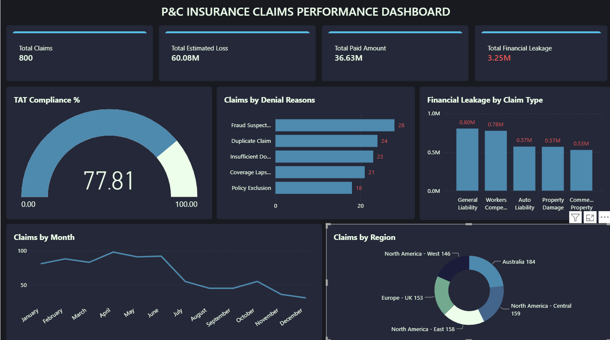

# 🛡️ P&C Insurance Claims Analysis — SQL + Power BI

## Project Overview
An end-to-end data analysis project simulating a **Property & Casualty (P&C) insurance claims operations dashboard** — built from 14 months of hands-on claims adjudication experience at a global insurance process delivery firm.

This project tracks the KPIs that matter most in P&C claims operations:
- SLA / TAT compliance (14-day resolution standard)
- Financial leakage detection (under-payment & over-payment)
- Denial reason analysis
- Adjuster performance benchmarking
- Regional risk patterns

---

## 🗂️ Dataset
- **Source:** Simulated dataset (800 records) modelled on real P&C claims workflows
- **Period:** January 2023 – June 2024
- **Claim Types:** Property Damage, Auto Liability, Commercial Property, Workers Compensation, General Liability
- **Regions:** North America (East/West/Central), Europe (UK), Australia
- **File:** `PC_Claims_Dataset.csv`

| Column | Description |
|--------|-------------|
| Claim_ID | Unique claim identifier |
| Claim_Type | Type of P&C claim |
| Region | Geographic region |
| Adjuster | Assigned claims adjuster |
| Date_Filed | Date claim was submitted |
| Date_Closed | Date claim was resolved |
| TAT_Days | Turnaround time in days |
| Status | Open / Closed |
| Estimated_Loss_USD | Assessed loss value |
| Paid_Amount_USD | Actual amount paid |
| Denial_Reason | Reason for denial (if applicable) |
| Leakage_USD | Financial variance (Paid - Estimated) |

---

## 🔍 SQL Analysis (12 Queries)
File: `PC_Claims_SQL_Queries.sql`

| Query | Business Question |
|-------|-------------------|
| Q1 | Overall claims portfolio summary |
| Q2 | TAT compliance rate vs. 14-day SLA |
| Q3 | TAT breach rate by claim type |
| Q4 | Top denial reasons |
| Q5 | Financial leakage — under vs. over payment |
| Q6 | Leakage breakdown by claim type |
| Q7 | Monthly claims volume trend |
| Q8 | Adjuster performance scorecard |
| Q9 | Regional performance breakdown |
| Q10 | High-value open claims watchlist |
| Q11 | Wrongful denial risk check |
| Q12 | SLA compliance trend by month |

---

## 📊 Power BI Dashboard



| Visual | Type | Insight |
|--------|------|---------|
| KPI Cards | Card x4 | Total Claims, Estimated Loss, Paid Amount, Total Financial Leakage |
| TAT Compliance % | KPI Gauge | % of claims resolved within the 14-day SLA |
| Claims by Denial Reasons | Bar Chart | Breakdown of top 5 denial reasons |
| Financial Leakage by Claim Type | Column Chart | Leakage exposure ranked by claim category |
| Claims by Month | Line Chart | Monthly claims volume trend |
| Claims by Region | Donut Chart | Geographic distribution of claims |

---

## 🔑 Key Findings

- **TAT Compliance Rate:** 77.81% of closed claims resolved within the 14-day SLA (avg. 11 days, max 35 days)
- **Top Denial Reason:** Fraud Suspected (24.56% of all denials), followed by Duplicate Claim and Insufficient Documentation
- **Total Financial Leakage:** $3.25M detected — $2.56M in underpayment, $688K in overpayment
- **Highest Leakage Category:** General Liability claims ($0.80M), closely followed by Workers Compensation ($0.78M)
- **Highest TAT Breach Rate:** General Liability claims (25.58% breach rate vs. 17.22% for Workers Compensation)
- **Regional Spread:** Claims fairly distributed across Australia, North America (East/Central/West), and Europe — UK, with Australia carrying the largest share at 184 claims

---

## 💼 Domain Context
This project was built using direct operational knowledge from:
- **Sutherland Global Services** — P&C Claims Resolution Specialist (1.2 years)
  - Resolved claims within 14-day TAT mandate
  - Conducted focused and general quality audits targeting financial leakage
  - Floor SME driving daily task completion
- **Omega Healthcare** — Insurance Claims Specialist (3.3 years)
  - High-value claims, aging reports, and adjudication under payer guidelines

---

## 🛠️ Tools Used
- **SQL** — Microsoft SQL Server / SSMS (data extraction, transformation, KPI calculation)
- **Power BI** — Dashboard design and visualisation, DAX measures
- **Excel** — Data validation and pre-processing

---

## 📁 Files in This Repository
```
├── PC_Claims_Dataset.csv          # 800-row simulated claims dataset
├── PC_Claims_SQL_Queries.sql      # 12 analytical SQL queries
├── PC_Claims_Dashboard.pbix       # Power BI dashboard file
├── dashboard_screenshot.png       # Full dashboard preview image
└── README.md                      # Project documentation
```

---

## 👤 Author
**Rakesh Kambar**
- 6 years experience in Insurance Operations & Risk (BFSI)
- Skills: SQL | Power BI | Tableau | Excel | Insurance Domain
- [LinkedIn](https://www.linkedin.com/in/rkambar01/)
- [GitHub](https://github.com/rkambar)
